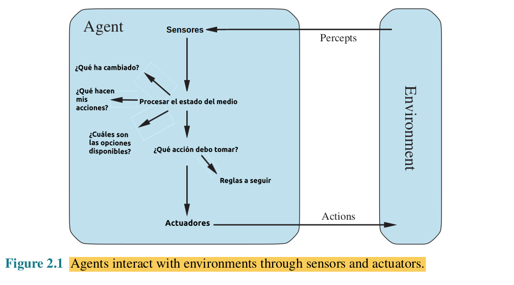
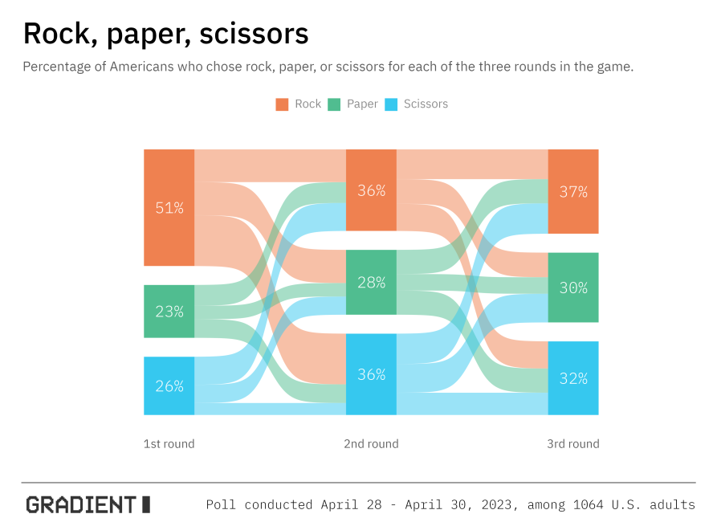
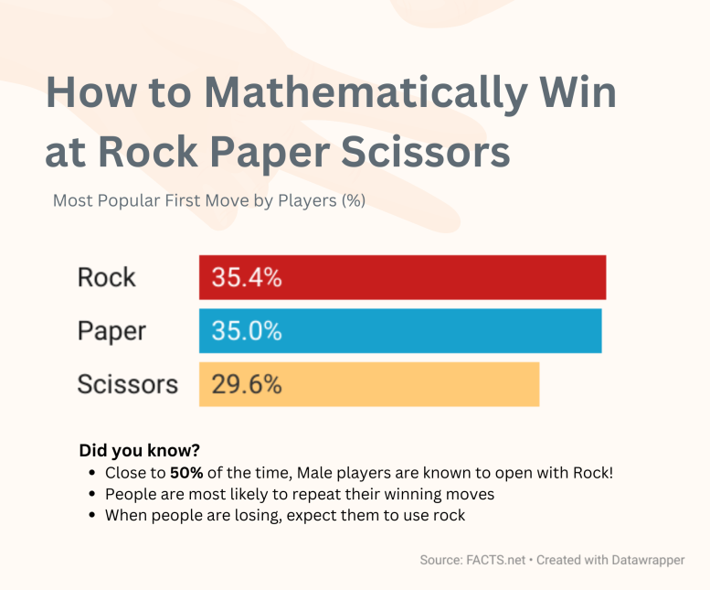
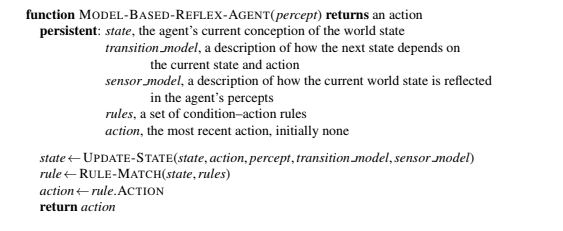

# Agente Inteligente para RPS

Mateo Manuel González Ulla - IES de Teis - 01/2024

### 1. El problema

Estudio de la solución del juego **piedra, papel, tijeras** a través de un agente inteligente programado en Python

### 2. Esquema de tareas

| Contorno de tareas |  Observable  | Agentes | Determinista | Episódico | Estático | Discreto | Conocido |
| :-----------------: | :----------: | :-----: | :----------: | :--------: | :-------: | :------: | :-------: |
|         RPS         | Parcialmente observable |  Multiagente  | Estocástico | Si | Si | Si | Si |

* **Parcialmente Observable:** No se puede saber qué piensa el agente rival.
* **Multiaxente:** Existen dos jugadores (agentes) que se enfrentan.
* **Estocástico:** Las acciones del agente varían el resultado en cada partida.
* **Episódico:** Cada partida es "independiente" de la anterior.
* **Estático:** El medio no cambia mientras el usuario piensa su acción.
* **Discreto:** Las variables a tener en cuenta son limitadas y discretas.
* **Coñecido:** Sabemos las reglas del juego en todo momento y no cambian.

### 3. Estructura del Agente

Una vez se conoce en profundidad el entorno de trabajo del agente, es posible definir con mayor precisión la estructura que este tomará. En este caso se ha optado por utilizar un programa de agente inteligente basado en modelos. 



El agente utiliza una estadística para las tres primeras rondas  sobre los movimientos más utilizados por los americanos (véanse las imágenes adjuntas). De este modo se intenta predecir cuál será el primer movimiento del rival y jugar en base a ese resultado, intentando siempre ganar.




Este tipo de agentes consideran el historial de partidas. Por lo tanto, pueden actuar en un escenario que no se observa por completo (como es en este caso con el agente RPS), teniendo así una visión más completa del mismo.

### 4. Implementación
Este agente está implementado en Python 3.10.12 y utiliza la librería Pandas. El código fue aportado por el usuario [@dfleta](https://github.com/dfleta) y modificado para acatar las necesidades de
este proyecto por [@jesus-fv](https://github.com/jesus-fv) y por mí. El código se encuentra en mi repositorio de Git (https://github.com/cuernomax2/Rock_Paper_Scissors_IntelligentAgent)



### 5. Utilización

Para poder utilizar este script, será necesario descargar el repo completo mediante ``` git clone https://github.com/cuernomax2/Rock_Paper_Scissors_IntelligentAgent/ ``` . Después, en una teminal, situarse en la carpeta "src" y lanzar el comando ``` python RPS_dict.py ```

### 6. Bibliografía

Lutz, Mark. _Learning Python_. Sebastopol, Ca, O’reilly, 2018.

Martin, Robert C. _Clean Code a Handbook of Agile Software Craftmanship_. Upper Saddle River [Etc.] Prentice Hall, 2010.

Martin, Robert C. _Clean Architecture: A Craftsman’s Guide to Software Structure and Design_. Prentice Hall, 2018.

S. McConnel. _Code Complete: A Practical Handbook of Software Construction_, 2dn Edition. Microsoft Press, 2004.

Russell, Peter. _ARTIFICIAL INTELLIGENCE : A Modern Approach_, Global Edition. S.L., Pearson Education Limited, 2021.

